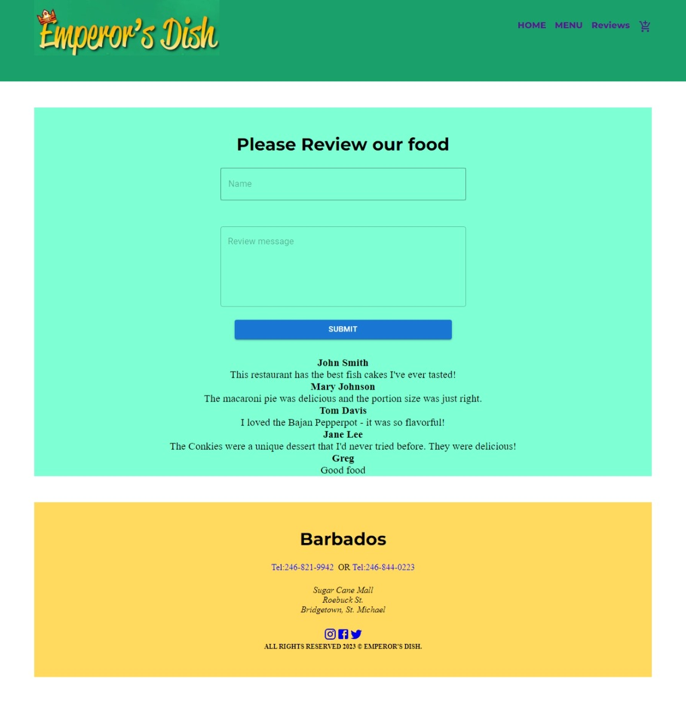
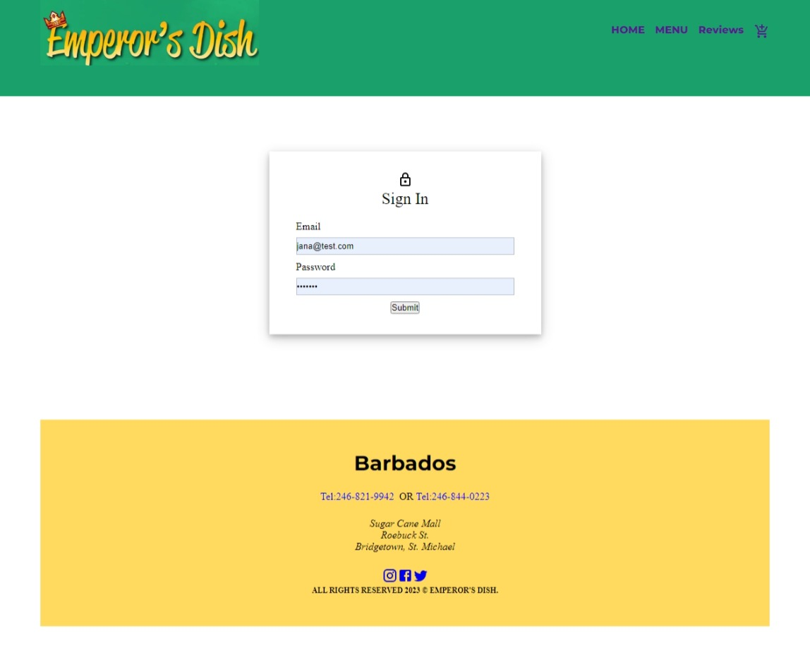

# EMPEROR'S DISH APP	

## Description

This is a full-stack MERN stack web application developed for a restaurant. The motivation was to showcase the team's ability to quickly develop a full-stack web application with modern technologies. The project solves the problem of allowing customers to browse the restaurant's menu and make orders online. Through this project, the team learned about the entire web development process, from designing and building the user interface to implementing backend functionality and deploying the application to a production environment. and gained experience in building a full-stack application with MERN technologies.

## Table of Contents

- [Installation](#installation)
- [Usage](#usage)
- [Credits](#credits)
- [License](#license)
- [Features](#features)
- [Badges](#badges)
- [Screenshots](#screenshots)

## Installation

This project has a live site. [Follow this link](https://emperors-dish-app.herokuapp.com/) to view Emperor's Dish App

To view to project on your localhost, first download or clone this repository from github. Then in the terminal, navigate to the project directory and install dependencies by typing "npm install", finally type "npm run seed" to seed to database and "npm run develop" to start the server and client simultaneously. 

## Usage

Once the app is running, you can browse the menu, place an order, and make a payment. The app also includes an admin section where the business owner can update the menu information.

For security reasons there is no link to the admin section displayed on the website. The address of the page is ["/admin"](http://localhost:3000/admin) (note: you may need to change the port # in the address according to your system).

To access this section please use the login criteria below:

Username - Jana@test.com
Password - jana123

## Credits

+ Dexter Dick - [view portfolio](https://github.com/DexterDick)
+ Jeena Vasudevan - [view portfolio](https://github.com/JeenaKozhimukkath)
+ Jaskirat Kaur- [view portfolio](https://github.com/JASKIRAT29)
+ Greg Griffith - [view portfolio](https://github.com/gregArijah)

## License

This project is licensed under the terms of the [MIT License](https://choosealicense.com/licenses/mit/).

## Features

- Online Ordering: Customers can view the menu, select items, and place an order directly from the app.
- Menu Management: Restaurant owner can manage the menu by adding, editing, and deleting items.
- User Authentication: Restaurant owner can log in to access their functionalities.
- Responsive Design: The app is fully responsive and can be accessed from any device, including desktops, laptops, tablets, and mobile phones.

#### Future Development
- Real-Time Order Tracking: Customers can track the status of their order in real-time and receive updates when their order is being prepared, cooked, and ready for pickup/delivery.
- Order Management: Restaurant owners can manage orders by viewing and updating the status of each order.
- Analytics Dashboard: Restaurant owners can track sales, orders, and other key metrics through an intuitive dashboard.

## Badges
                     

## Questions

Reach out to anyone listed in the Credits section for more details.

## Screenshots

